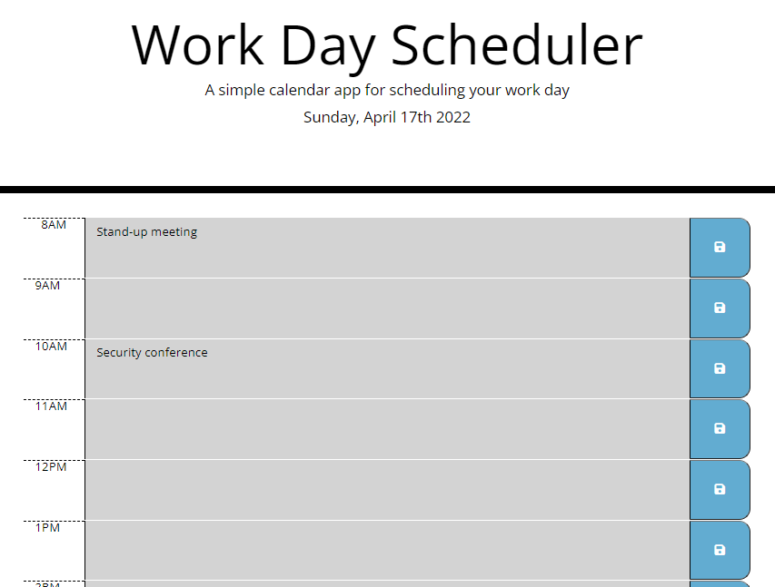

# Work Day Scheduler

## Description
This is a workday calendar to keep people organized! The current date is listed at the top of the schedule, and the day is broken up into rows by the hour. Past hours will be gray, the current hour is red, and future hours are in green. Upon pressing the floppy disk save button, the task will be saved.

## Link to deployed application
<a href = "https://mjzabriskie.github.io/work-day-scheduler/">https://mjzabriskie.github.io/work-day-scheduler/</a>

## Screenshot

